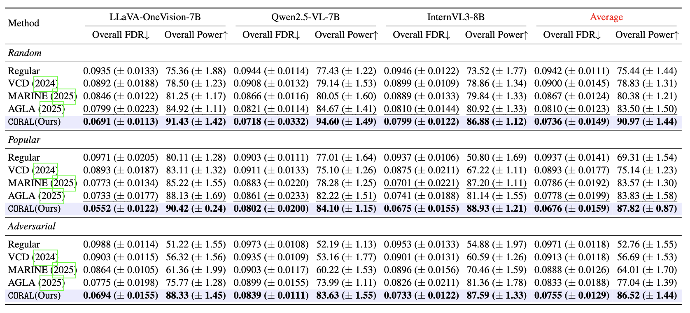
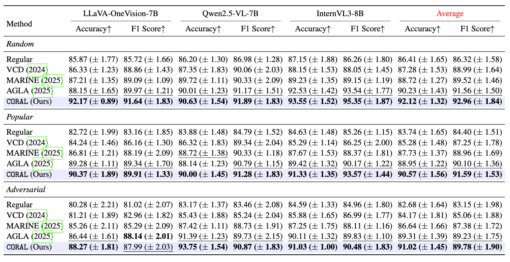
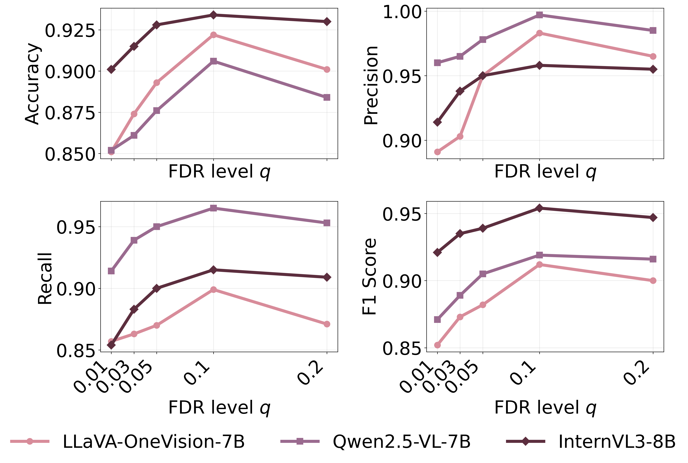
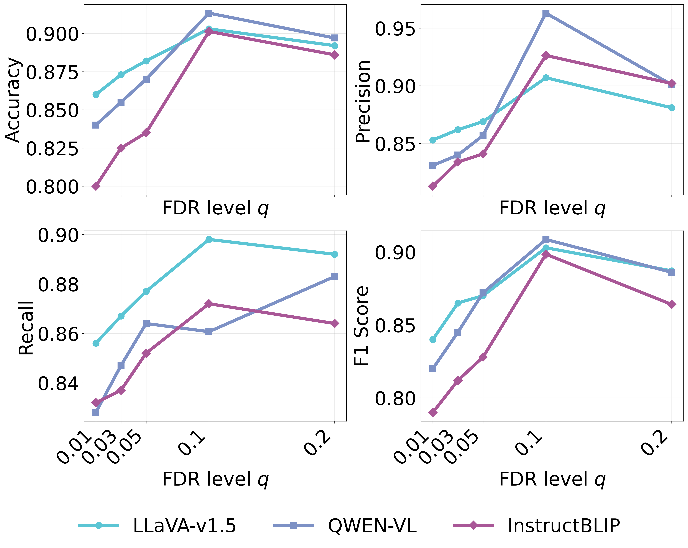

# CORAL: Mitigating Object Hallucination in Large Vision-Language Models via False Discovery Controlled Visual Data Splitting
We propose a false discovery rate **CO**nt**R**ol of object h**AL**lucination (**CORAL**), a training-free and API-free framework that models visual uncertainty using a data-splitting approach controlled by the false discovery rate.

## Overview

## Key Ideas
- CORAL uses **visual uncertainty splitting** strategy to construct two independent visual inputs from each image to induce controlled visual uncertainty. 
- CORAL leverages the **mirror statistics** derived from the split visual inputs to quantify visual uncertainty by controlling the FDR and maximizing the power within an image.  
- CORAL is a **training-free and API-free** method that mitigates object hallucination with a favorable trade-off between latency and accuracy, achieving low computational overhead compared to existing approaches. 

## Usage

### Environment Setup
To install requirements:

```setup
pip install -r requirements.txt
```

### How to Use CORAL in LVLMs
To train the model(s) in the paper, run this command:

```train
python3 eval_llava.py
  --model_id "liuhaotian/llava-v1.5-7b"
  --aokvqa_json "/path/aokvqa_pope_random.json"
  --aokvqa_img_dir "/path/"
  --device "cuda:0"
  --q 0.10
  --out_dir "./debug"
```
### Structure
```bash
coral/
├── data_split/            # Visual uncertainty splitting strategies
├── eval/                  # FDR, power, and evaluation utilities
├── mirror_statistics.py   # Mirror statistic construction
├── fdr_power_run.py       # FDR control and power computation
├── __init__.py
├── test.py                # Minimal sanity check
└── requirement.txt
experiments/
├── MARINE/                # MARINE baseline
├── QWEN-VL/               # Qwen-VL backend
├── VCD/                   # VCD baseline
├── llava/                 # LLaVA backend
├── lavis/                 # InstructBLIP / LAVIS-based models
├── dataset/               # Dataset loaders and preprocessing
└── eval/                  # POPE / CHAIR / MME evaluation scripts                 
README.md                         
```

## Experiments
We evaluate CORAL on object hallucination benchmarks, including POPE, CHAIR, and MME, demonstrating consistent improvements in hallucination suppression under controlled FDR. 

Table 1. Evaluation of overall FDR control and overall power across multiple LVLM architectures on MSCOCO with 3000 replicates. **Bold** indicates the best result and <ins>underline</ins> indicates the second-best result in each column. 



Table 2. Evaluation with POPE score across multiple LVLM architectures on the MSCOCO dataset. We report individualized Accuracy and F1 score (mean $\pm$ standard deviation over 3000 runs). **Bold** indicates the best result and <ins>underline</ins> indicates the second-best result. 



Table 3. Ablation study on the effect of FDR target level ($q$) on the performance of LLaVA-v1.5, QWEN-VL, InstructBLIP using POPE metrics with $q = \{0.01, 0.03, 0.05, 0.1, 0.2\}$.




## Examples


## Related Papers
This code is based on:
- **VCD**: [VCD](https://github.com/DAMO-NLP-SG/VCD)
- **Data Splitting**: [DS](https://github.com/Jeremy690/DSfdr)
- **Mirror Statistics**: [MS](https://doi.org/10.1080/01621459.2021.1923510)
