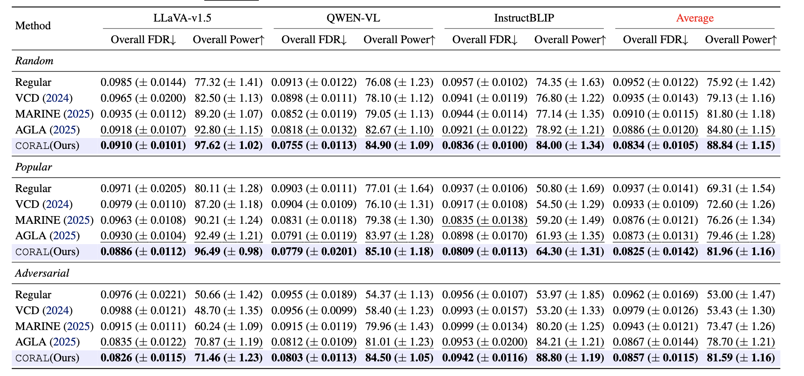
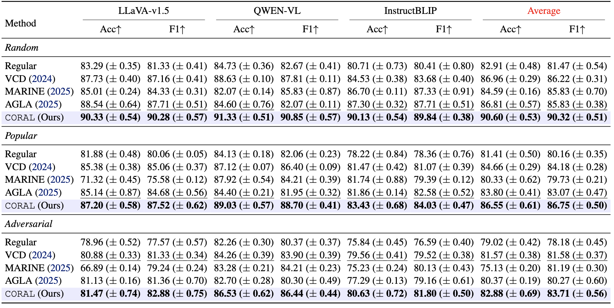
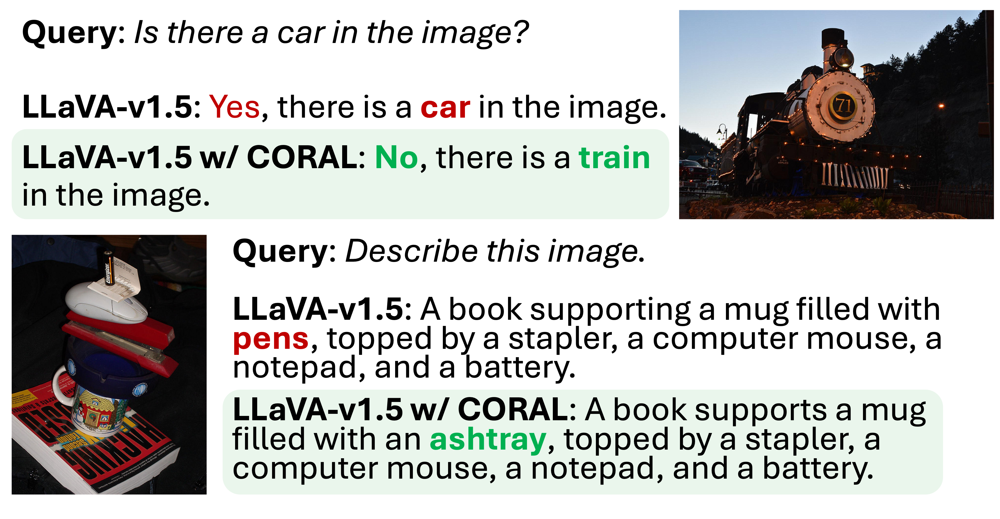

# CORAL: Mitigating Object Hallucination in Large Vision-Language Models via False Discovery Controlled Visual Data Splitting
We propose a false discovery rate **CO**nt**R**ol of object h**AL**lucination (**CORAL**), a training-free and API-free framework that models visual uncertainty using a data-splitting approach controlled by the false discovery rate.

## Overview

## Key Ideas
- CORAL uses **visual uncertainty splitting** strategy to construct two independent visual inputs from each image to induce controlled visual uncertainty. 
- CORAL leverages the **mirror statistics** derived from the split visual inputs to quantify visual uncertainty by controlling the FDR and maximizing the power within an image.  
- CORAL is a **training-free and API-free** method that mitigates object hallucination with a favorable trade-off between latency and accuracy, achieving low computational overhead compared to existing approaches. 

## Usage

### Environment Setup

### How to Use CORAL in LVLMs

## Experiments
We evaluate CORAL on object hallucination benchmarks, including POPE, CHAIR, and MME, demonstrating consistent improvements in hallucination suppression under controlled FDR.
Table 1. Result of FDR and Power

Table 2. Result on POPE. 

## Examples

## Related Papers
